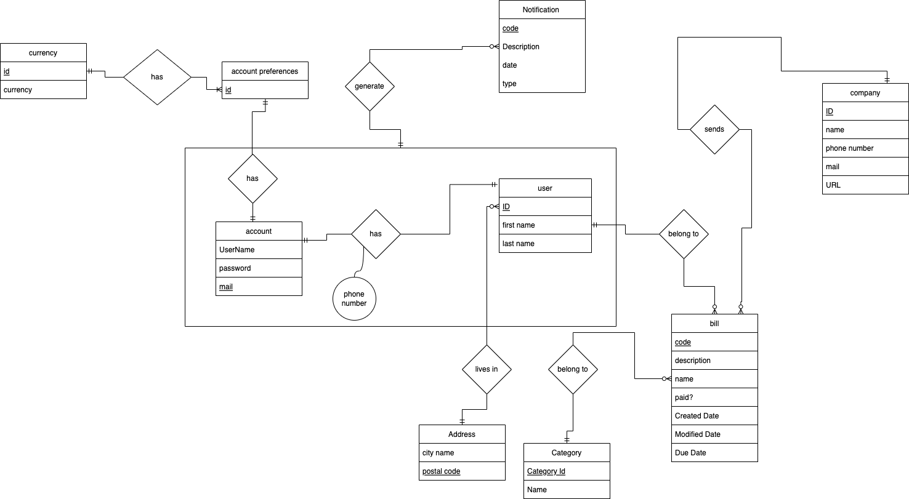
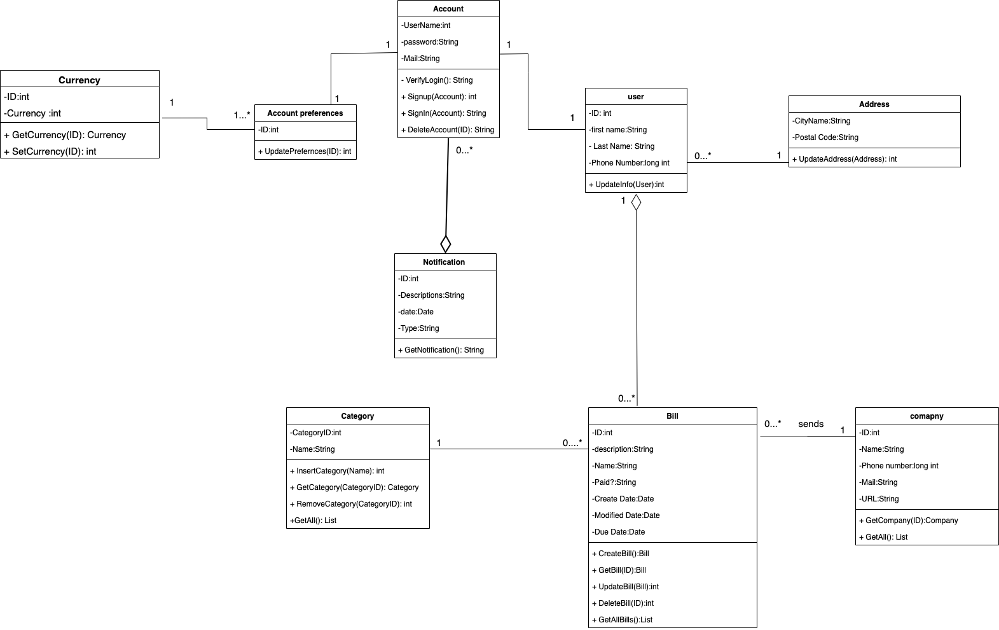
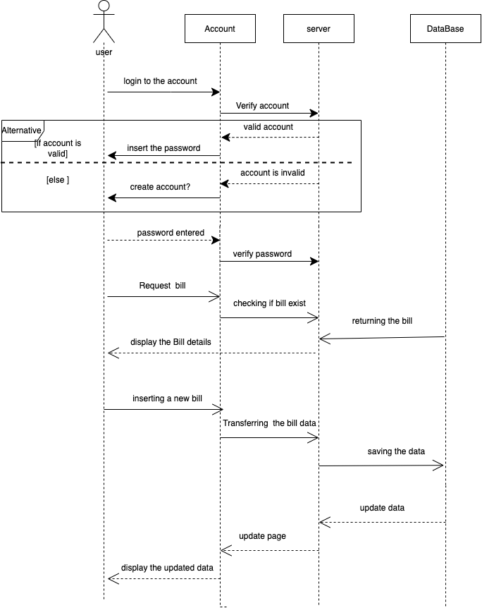

# Bill Tracker
Live link: https://spectacular-goat-schism-dev.wayscript.cloud
## Table of contents
* [General info](#general-info)
* [Database diagram](#database-diagram)
* [Class diagram](#class-diagram)
* [Sequence diagram](#sequence-diagram)
* [Technologies](#technologies)
* [Setup](#setup)
* [Deployment](#deployment)

## General info
I decided on developing a **bill tracker** web application that will have the
following features:
* **Log bills, amounts and date**: 
A user will be able to log passed/upcoming bills manually not only that but also editing them.Also, The user is able to add a company details manually as well as a custom category to the bills. ``there's an option to mark the bill as paid for the user when creating/editing a bill.
* **List bills**: 
The user will be able to list and search all his bills by different factors; such
as date/amount/company etc...
* **Have graphs that shows data about bills**: 
Graphs for the user to show analytical data about the bills in terms of
bills amounts in monthly basis and the paid ones as well as the distrbuition of the bills based on the categories.
* **Store data somewhere**: 
The user data will be available on a cloud database so the user will be
able to view the data from anywhere.

* **Registration and Login**: 
In order to start using the application, user has to sign up with his info such as first and last name, phone number and email. Once registration is done, user can login and start using the application immediately. 

* **Authentication**:
There are many excellent Python authentication packages, but none of them do every‐
thing.This is the list of packages
that will be used:
* Flask-Login: Management of user sessions for logged-in users
* Werkzeug: Password hashing and verification
* itsdangerous: Cryptographically secure token generation and verification
In addition to authentication-specific packages, the following general-purpose exten‐
sions will be used:
* Flask-Mail: Sending of authentication-related emails
* Flask-Bootstrap: HTML templates
* Flask-WTF: Web forms

Additional uses: such as cookies

## Database diagram
    
## Class diagram

## Sequence diagram

## Technologies
Project is created with:
* Flask version: 2.2.2
* Jinja2 version: 3.1.2
* SQLAlchemy version: 1.4.41
* Flask-Bootstrap: 2.2.1 
* JQuery: 2.0.x
	
## Setup
To run this project, follow the steps [here](https://phoenixnap.com/kb/install-flask)

## Deployment
Deployment of the project will be done through azure web services.
Steps for the deployment found [here](https://docs.microsoft.com/en-us/azure/app-service/quickstart-python?tabs=flask%2Cwindows%2Cazure-cli%2Cvscode-deploy%2Cdeploy-instructions-azportal%2Cterminal-bash%2Cdeploy-instructions-zip-azcli)

**Tarik Bakir , ID:207426255**
